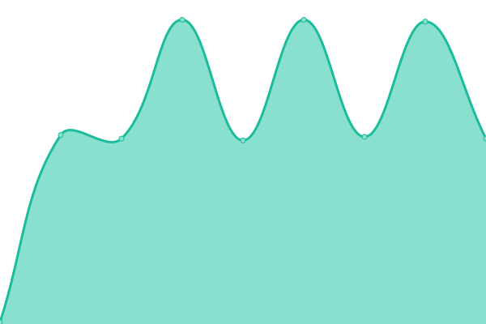
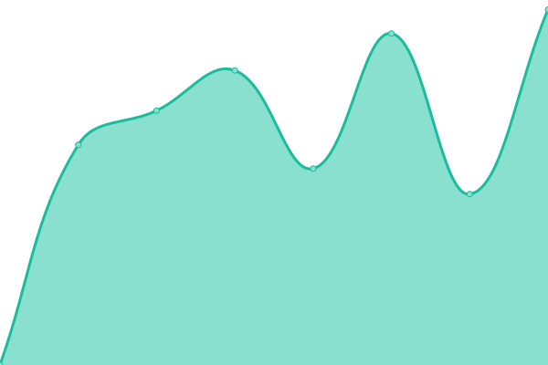
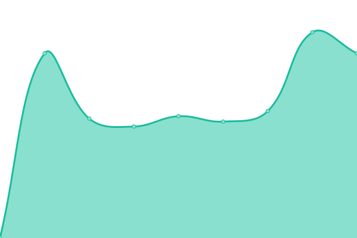
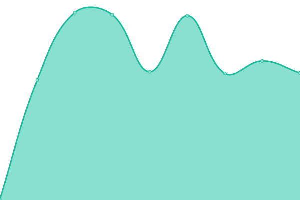
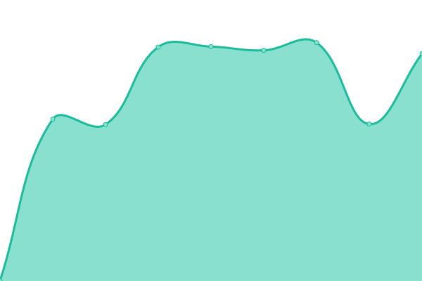
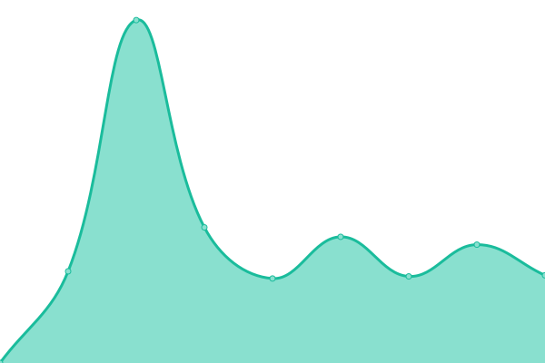
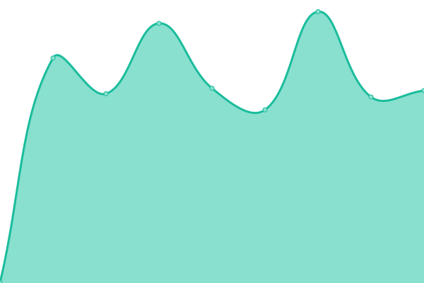

# [📈 Live Status](https://c1rus.github.io/uptime/): <!--live status--> **🟩 All systems operational**

<!--start: status pages-->
<!-- This summary is generated by Upptime (https://github.com/upptime/upptime) -->
<!-- Do not edit this manually, your changes will be overwritten -->
<!-- prettier-ignore -->
| URL | Status | History | Response Time | Uptime |
| --- | ------ | ------- | ------------- | ------ |
|  [hint.hollen.sk](https://hint.hollen.sk/) | 🟩 Up | [hint-hollen-sk.yml](https://github.com/c1rus/uptime/commits/HEAD/history/hint-hollen-sk.yml) | 

 769ms
     
 | 

<a href="https://c1rus.github.io/uptime/history/hint-hollen-sk">100.00%</a>
    

|  [www.dubravka.sk](https://www.dubravka.sk/) | 🟩 Up | [www-dubravka-sk.yml](https://github.com/c1rus/uptime/commits/HEAD/history/www-dubravka-sk.yml) | 

 1431ms
     
 | 

<a href="https://c1rus.github.io/uptime/history/www-dubravka-sk">100.00%</a>
    

|  [www.priklady.eu](https://www.priklady.eu/sk/Index.alej) | 🟩 Up | [www-priklady-eu.yml](https://github.com/c1rus/uptime/commits/HEAD/history/www-priklady-eu.yml) | 

 8119ms
     
 | 

<a href="https://c1rus.github.io/uptime/history/www-priklady-eu">100.00%</a>
    

|  [www.rosler.sk](https://www.rosler.sk/) | 🟩 Up | [www-rosler-sk.yml](https://github.com/c1rus/uptime/commits/HEAD/history/www-rosler-sk.yml) | 

 1907ms
     
 | 

<a href="https://c1rus.github.io/uptime/history/www-rosler-sk">100.00%</a>
    

|  [www.sizp.sk](https://www.sizp.sk/) | 🟩 Up | [www-sizp-sk.yml](https://github.com/c1rus/uptime/commits/HEAD/history/www-sizp-sk.yml) | 

 1638ms
     
 | 

<a href="https://c1rus.github.io/uptime/history/www-sizp-sk">100.00%</a>
    

|  [master.kabernet.sk](https://master.kabernet.sk/) | 🟩 Up | [master-kabernet-sk.yml](https://github.com/c1rus/uptime/commits/HEAD/history/master-kabernet-sk.yml) | 

 1484ms
     
 | 

<a href="https://c1rus.github.io/uptime/history/master-kabernet-sk">100.00%</a>
    

|  [www.kabernet.sk](https://www.kabernet.sk) | 🟩 Up | [www-kabernet-sk.yml](https://github.com/c1rus/uptime/commits/HEAD/history/www-kabernet-sk.yml) | 

 976ms
     
 | 

<a href="https://c1rus.github.io/uptime/history/www-kabernet-sk">100.00%</a>
    

|  [www.idl.sk](https://www.idl.sk) | 🟩 Up | [www-idl-sk.yml](https://github.com/c1rus/uptime/commits/HEAD/history/www-idl-sk.yml) | 

 1089ms
     
 | 

<a href="https://c1rus.github.io/uptime/history/www-idl-sk">100.00%</a>
    

|  [www.slovakiatech.sk](https://www.slovakiatech.sk) | 🟩 Up | [www-slovakiatech-sk.yml](https://github.com/c1rus/uptime/commits/HEAD/history/www-slovakiatech-sk.yml) | 

 997ms
     
 | 

<a href="https://c1rus.github.io/uptime/history/www-slovakiatech-sk">100.00%</a>
    

|  [www.sokratovinstitut.sk](https://www.sokratovinstitut.sk) | 🟩 Up | [www-sokratovinstitut-sk.yml](https://github.com/c1rus/uptime/commits/HEAD/history/www-sokratovinstitut-sk.yml) | 

 6974ms
     
 | 

<a href="https://c1rus.github.io/uptime/history/www-sokratovinstitut-sk">99.94%</a>
    

|  [www.koucovaciaskola.sk](https://www.koucovaciaskola.sk) | 🟩 Up | [www-koucovaciaskola-sk.yml](https://github.com/c1rus/uptime/commits/HEAD/history/www-koucovaciaskola-sk.yml) | 

 1613ms
     
 | 

<a href="https://c1rus.github.io/uptime/history/www-koucovaciaskola-sk">100.00%</a>
    

|  [www.horecaclub.sk](https://www.horecaclub.sk) | 🟩 Up | [www-horecaclub-sk.yml](https://github.com/c1rus/uptime/commits/HEAD/history/www-horecaclub-sk.yml) | 

 778ms
     
 | 

<a href="https://c1rus.github.io/uptime/history/www-horecaclub-sk">100.00%</a>
    

|  [www.rackscale.sk](https://www.rackscale.sk) | 🟩 Up | [www-rackscale-sk.yml](https://github.com/c1rus/uptime/commits/HEAD/history/www-rackscale-sk.yml) | 

 972ms
     
 | 

<a href="https://c1rus.github.io/uptime/history/www-rackscale-sk">100.00%</a>
    

|  [www.natureland.sk](https://www.natureland.sk) | 🟩 Up | [www-natureland-sk.yml](https://github.com/c1rus/uptime/commits/HEAD/history/www-natureland-sk.yml) | 

 1331ms
     
 | 

<a href="https://c1rus.github.io/uptime/history/www-natureland-sk">100.00%</a>
    

|  [www.virtualsan.sk](https://www.virtualsan.sk) | 🟩 Up | [www-virtualsan-sk.yml](https://github.com/c1rus/uptime/commits/HEAD/history/www-virtualsan-sk.yml) | 

 970ms
     
 | 

<a href="https://c1rus.github.io/uptime/history/www-virtualsan-sk">100.00%</a>
    

|  [www.optikafontana.sk](https://www.optikafontana.sk) | 🟩 Up | [www-optikafontana-sk.yml](https://github.com/c1rus/uptime/commits/HEAD/history/www-optikafontana-sk.yml) | 

 1716ms
     
 | 

<a href="https://c1rus.github.io/uptime/history/www-optikafontana-sk">100.00%</a>
    

|  [www.levare.sk](https://www.levare.sk) | 🟩 Up | [www-levare-sk.yml](https://github.com/c1rus/uptime/commits/HEAD/history/www-levare-sk.yml) | 

 1287ms
     
 | 

<a href="https://c1rus.github.io/uptime/history/www-levare-sk">100.00%</a>
    

|  [www.bellavista.sk](https://www.bellavista.sk) | 🟩 Up | [www-bellavista-sk.yml](https://github.com/c1rus/uptime/commits/HEAD/history/www-bellavista-sk.yml) | 

 1581ms
     
 | 

<a href="https://c1rus.github.io/uptime/history/www-bellavista-sk">100.00%</a>
    

|  [www.lepsilamac.sk](https://www.lepsilamac.sk/co-robime) | 🟩 Up | [www-lepsilamac-sk.yml](https://github.com/c1rus/uptime/commits/HEAD/history/www-lepsilamac-sk.yml) | 

 1735ms
     
 | 

<a href="https://c1rus.github.io/uptime/history/www-lepsilamac-sk">100.00%</a>
    

|  [www.clc.sk](https://www.clc.sk) | 🟩 Up | [www-clc-sk.yml](https://github.com/c1rus/uptime/commits/HEAD/history/www-clc-sk.yml) | 

 1224ms
     
 | 

<a href="https://c1rus.github.io/uptime/history/www-clc-sk">100.00%</a>
    

|  [www.pefc.sk](https://www.pefc.sk) | 🟩 Up | [www-pefc-sk.yml](https://github.com/c1rus/uptime/commits/HEAD/history/www-pefc-sk.yml) | 

 1276ms
     
 | 

<a href="https://c1rus.github.io/uptime/history/www-pefc-sk">100.00%</a>
    

|  [www.garancnyfond.sk](https://www.garancnyfond.sk) | 🟩 Up | [www-garancnyfond-sk.yml](https://github.com/c1rus/uptime/commits/HEAD/history/www-garancnyfond-sk.yml) | 

 804ms
     
 | 

<a href="https://c1rus.github.io/uptime/history/www-garancnyfond-sk">100.00%</a>
    

|  [www.amplia.sk](https://www.amplia.sk) | 🟩 Up | [www-amplia-sk.yml](https://github.com/c1rus/uptime/commits/HEAD/history/www-amplia-sk.yml) | 

 983ms
     
 | 

<a href="https://c1rus.github.io/uptime/history/www-amplia-sk">100.00%</a>
    

|  [www.itvkurze.sk](https://www.itvkurze.sk) | 🟩 Up | [www-itvkurze-sk.yml](https://github.com/c1rus/uptime/commits/HEAD/history/www-itvkurze-sk.yml) | 

 823ms
     
 | 

<a href="https://c1rus.github.io/uptime/history/www-itvkurze-sk">100.00%</a>
    

|  [www.lamac.sk](https://www.lamac.sk) | 🟩 Up | [www-lamac-sk.yml](https://github.com/c1rus/uptime/commits/HEAD/history/www-lamac-sk.yml) | 

 1862ms
     
 | 

<a href="https://c1rus.github.io/uptime/history/www-lamac-sk">100.00%</a>
    

|  [www.livinn.sk](https://www.livinn.sk) | 🟩 Up | [www-livinn-sk.yml](https://github.com/c1rus/uptime/commits/HEAD/history/www-livinn-sk.yml) | 

 1046ms
     
 | 

<a href="https://c1rus.github.io/uptime/history/www-livinn-sk">100.00%</a>
    

|  [www.widex-eshop.sk](https://www.widex-eshop.sk/) | 🟩 Up | [www-widex-eshop-sk.yml](https://github.com/c1rus/uptime/commits/HEAD/history/www-widex-eshop-sk.yml) | 

 1166ms
     
 | 

<a href="https://c1rus.github.io/uptime/history/www-widex-eshop-sk">100.00%</a>
    

|  [www.starsforstars.eu](https://www.starsforstars.eu/) | 🟩 Up | [www-starsforstars-eu.yml](https://github.com/c1rus/uptime/commits/HEAD/history/www-starsforstars-eu.yml) | 

 1215ms
     
 | 

<a href="https://c1rus.github.io/uptime/history/www-starsforstars-eu">100.00%</a>
    

|  [www.baoffice.sk](https://www.baoffice.sk/) | 🟩 Up | [www-baoffice-sk.yml](https://github.com/c1rus/uptime/commits/HEAD/history/www-baoffice-sk.yml) | 

 735ms
     
 | 

<a href="https://c1rus.github.io/uptime/history/www-baoffice-sk">80.79%</a>
    

|  [www.rosler.sk](https://www.rosler.sk/) | 🟩 Up | [www-rosler-sk.yml](https://github.com/c1rus/uptime/commits/HEAD/history/www-rosler-sk.yml) | 

 1907ms
     
 | 

<a href="https://c1rus.github.io/uptime/history/www-rosler-sk">100.00%</a>
    

|  [www.zuriarchitecture.com](https://www.zuriarchitecture.com/) | 🟩 Up | [www-zuriarchitecture-com.yml](https://github.com/c1rus/uptime/commits/HEAD/history/www-zuriarchitecture-com.yml) | 

 928ms
     
 | 

<a href="https://c1rus.github.io/uptime/history/www-zuriarchitecture-com">100.00%</a>
    

|  [easyestate.sk](https://easyestate.sk/) | 🟩 Up | [easyestate-sk.yml](https://github.com/c1rus/uptime/commits/HEAD/history/easyestate-sk.yml) | 

 919ms
     
 | 

<a href="https://c1rus.github.io/uptime/history/easyestate-sk">100.00%</a>
    

|  [alejtech.sk](https://www.alejtech.sk/) | 🟩 Up | [alejtech-sk.yml](https://github.com/c1rus/uptime/commits/HEAD/history/alejtech-sk.yml) | 

 1205ms
     
 | 

<a href="https://c1rus.github.io/uptime/history/alejtech-sk">100.00%</a>
    

<!--end: status pages-->

[**Visit our status website →**](https://c1rus.github.io/uptime/)

## 📄 License

- Powered by: [Upptime](https://github.com/upptime/upptime)
- Code: [MIT](./LICENSE) © [Upptime](https://upptime.js.org)
- Data in the `./history` directory: [Open Database License](https://opendatacommons.org/licenses/odbl/1-0/)
