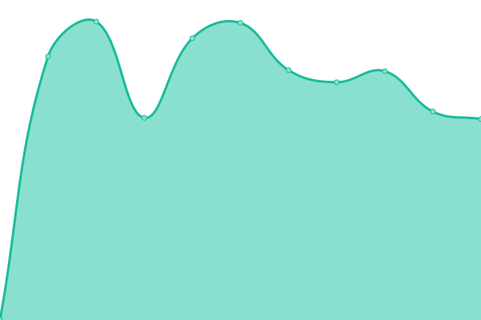

# [📈 Live Status](https://c1rus.github.io/uptime/): <!--live status--> **🟧 Partial outage**

<!--start: status pages-->
<!-- This summary is generated by Upptime (https://github.com/upptime/upptime) -->
<!-- Do not edit this manually, your changes will be overwritten -->
<!-- prettier-ignore -->
| URL | Status | History | Response Time | Uptime |
| --- | ------ | ------- | ------------- | ------ |
|  [hint](https://hint.hollen.sk/) | 🟩 Up | [hint.yml](https://github.com/c1rus/uptime/commits/HEAD/history/hint.yml) | 

 695ms
     
 | 

<a href="https://c1rus.github.io/uptime/history/hint">99.86%</a>
    

|  [admin.metriq](https://admin.metriq.app/) | 🟩 Up | [admin-metriq.yml](https://github.com/c1rus/uptime/commits/HEAD/history/admin-metriq.yml) | 

 1187ms
     
 | 

<a href="https://c1rus.github.io/uptime/history/admin-metriq">100.00%</a>
    

|  [input.metriq](https://input.metriq.app/) | 🟩 Up | [input-metriq.yml](https://github.com/c1rus/uptime/commits/HEAD/history/input-metriq.yml) | 

 1010ms
     
 | 

<a href="https://c1rus.github.io/uptime/history/input-metriq">100.00%</a>
    

|  [view.metriq](https://view.metriq.app/) | 🟩 Up | [view-metriq.yml](https://github.com/c1rus/uptime/commits/HEAD/history/view-metriq.yml) | 

 970ms
     
 | 

<a href="https://c1rus.github.io/uptime/history/view-metriq">100.00%</a>
    

|  [priklady.eu](https://www.priklady.eu/sk/Index.alej) | 🟩 Up | [priklady-eu.yml](https://github.com/c1rus/uptime/commits/HEAD/history/priklady-eu.yml) | 

 2242ms
     
 | 

<a href="https://c1rus.github.io/uptime/history/priklady-eu">99.88%</a>
    

|  [master.kabernet.sk](https://master.kabernet.sk/) | 🟩 Up | [master-kabernet-sk.yml](https://github.com/c1rus/uptime/commits/HEAD/history/master-kabernet-sk.yml) | 

 1430ms
     
 | 

<a href="https://c1rus.github.io/uptime/history/master-kabernet-sk">99.86%</a>
    

|  [1cornhill](http://www.iiplt.lu) | 🟩 Up | [1cornhill.yml](https://github.com/c1rus/uptime/commits/HEAD/history/1cornhill.yml) | 

 1763ms
     
 | 

<a href="https://c1rus.github.io/uptime/history/1cornhill">100.00%</a>
    

|  [1sjs](https://www.1sjs.sk) | 🟩 Up | [1sjs.yml](https://github.com/c1rus/uptime/commits/HEAD/history/1sjs.yml) | 

 1976ms
     
 | 

<a href="https://c1rus.github.io/uptime/history/1sjs">99.73%</a>
    

|  [2pmd](http://www.2pmd.sk) | 🟩 Up | [2pmd.yml](https://github.com/c1rus/uptime/commits/HEAD/history/2pmd.yml) | 

 3781ms
     
 | 

<a href="https://c1rus.github.io/uptime/history/2pmd">99.74%</a>
    

|  [addcar-cee](https://www.addcar-cee.sk) | 🟩 Up | [addcar-cee.yml](https://github.com/c1rus/uptime/commits/HEAD/history/addcar-cee.yml) | 

 693ms
     
 | 

<a href="https://c1rus.github.io/uptime/history/addcar-cee">0.00%</a>
    

|  [air-air](https://www.air-air.sk/) | 🟩 Up | [air-air.yml](https://github.com/c1rus/uptime/commits/HEAD/history/air-air.yml) | 

 997ms
     
 | 

<a href="https://c1rus.github.io/uptime/history/air-air">99.74%</a>
    

|  [alejtech](https://www.alejtech.sk/) | 🟩 Up | [alejtech.yml](https://github.com/c1rus/uptime/commits/HEAD/history/alejtech.yml) | 

 1346ms
     
 | 

<a href="https://c1rus.github.io/uptime/history/alejtech">99.74%</a>
    

|  [amplia](http://www.amplia.sk/) | 🟩 Up | [amplia.yml](https://github.com/c1rus/uptime/commits/HEAD/history/amplia.yml) | 

 3433ms
     
 | 

<a href="https://c1rus.github.io/uptime/history/amplia">99.74%</a>
    

|  [archdom](https://www.archdom.sk/) | 🟩 Up | [archdom.yml](https://github.com/c1rus/uptime/commits/HEAD/history/archdom.yml) | 

 964ms
     
 | 

<a href="https://c1rus.github.io/uptime/history/archdom">100.00%</a>
    

|  [archicube](http://www.mirko.sk/) | 🟩 Up | [archicube.yml](https://github.com/c1rus/uptime/commits/HEAD/history/archicube.yml) | 

 1033ms
     
 | 

<a href="https://c1rus.github.io/uptime/history/archicube">0.00%</a>
    

|  [archivovanie](https://www.archivovanie.sk) | 🟩 Up | [archivovanie.yml](https://github.com/c1rus/uptime/commits/HEAD/history/archivovanie.yml) | 

 2976ms
     
 | 

<a href="https://c1rus.github.io/uptime/history/archivovanie">0.04%</a>
    

|  [arkadyhof](https://www.arkadyhof.sk) | 🟩 Up | [arkadyhof.yml](https://github.com/c1rus/uptime/commits/HEAD/history/arkadyhof.yml) | 

 1075ms
     
 | 

<a href="https://c1rus.github.io/uptime/history/arkadyhof">100.00%</a>
    

|  [asseco-erp](https://asseco-cloud.sk) | 🟩 Up | [asseco-erp.yml](https://github.com/c1rus/uptime/commits/HEAD/history/asseco-erp.yml) | 

 963ms
     
 | 

<a href="https://c1rus.github.io/uptime/history/asseco-erp">100.00%</a>
    

|  [autentista](https://www.autentista.sk) | 🟩 Up | [autentista.yml](https://github.com/c1rus/uptime/commits/HEAD/history/autentista.yml) | 

 1286ms
     
 | 

<a href="https://c1rus.github.io/uptime/history/autentista">99.74%</a>
    

|  [back2life](https://www.back2life.sk) | 🟩 Up | [back2life.yml](https://github.com/c1rus/uptime/commits/HEAD/history/back2life.yml) | 

 2930ms
     
 | 

<a href="https://c1rus.github.io/uptime/history/back2life">99.74%</a>
    

|  [baiahouse](https://www.baia.sk) | 🟩 Up | [baiahouse.yml](https://github.com/c1rus/uptime/commits/HEAD/history/baiahouse.yml) | 

 930ms
     
 | 

<a href="https://c1rus.github.io/uptime/history/baiahouse">100.00%</a>
    

|  [balancelife](http://www.balancelife.sk/) | 🟩 Up | [balancelife.yml](https://github.com/c1rus/uptime/commits/HEAD/history/balancelife.yml) | 

 1188ms
     
 | 

<a href="https://c1rus.github.io/uptime/history/balancelife">99.74%</a>
    

|  [baoffice](https://www.baoffice.sk) | 🟩 Up | [baoffice.yml](https://github.com/c1rus/uptime/commits/HEAD/history/baoffice.yml) | 

 716ms
     
 | 

<a href="https://c1rus.github.io/uptime/history/baoffice">100.00%</a>
    

|  [barnakova](https://www.barnakova.sk) | 🟩 Up | [barnakova.yml](https://github.com/c1rus/uptime/commits/HEAD/history/barnakova.yml) | 

 1298ms
     
 | 

<a href="https://c1rus.github.io/uptime/history/barnakova">100.00%</a>
    

|  [bastapajstun](https://www.bastapajstun.sk) | 🟩 Up | [bastapajstun.yml](https://github.com/c1rus/uptime/commits/HEAD/history/bastapajstun.yml) | 

 1148ms
     
 | 

<a href="https://c1rus.github.io/uptime/history/bastapajstun">100.00%</a>
    

|  [bellavista](https://www.bellavista.sk) | 🟩 Up | [bellavista.yml](https://github.com/c1rus/uptime/commits/HEAD/history/bellavista.yml) | 

 1847ms
     
 | 

<a href="https://c1rus.github.io/uptime/history/bellavista">99.75%</a>
    

|  [bellinioleje](https://www.bellinioleje.sk/) | 🟩 Up | [bellinioleje.yml](https://github.com/c1rus/uptime/commits/HEAD/history/bellinioleje.yml) | 

 902ms
     
 | 

<a href="https://c1rus.github.io/uptime/history/bellinioleje">100.00%</a>
    

|  [betweenusagency](https://www.betweenusagency.sk/) | 🟩 Up | [betweenusagency.yml](https://github.com/c1rus/uptime/commits/HEAD/history/betweenusagency.yml) | 

 897ms
     
 | 

<a href="https://c1rus.github.io/uptime/history/betweenusagency">100.00%</a>
    

|  [bevori](http://www.bevori.sk) | 🟩 Up | [bevori.yml](https://github.com/c1rus/uptime/commits/HEAD/history/bevori.yml) | 

 1328ms
     
 | 

<a href="https://c1rus.github.io/uptime/history/bevori">100.00%</a>
    

|  [brilliantstars](http://www.brilliantstars.sk/) | 🟩 Up | [brilliantstars.yml](https://github.com/c1rus/uptime/commits/HEAD/history/brilliantstars.yml) | 

 2563ms
     
 | 

<a href="https://c1rus.github.io/uptime/history/brilliantstars">99.75%</a>
    

|  [carodejnik](http://www.carodejnikzkrajiny.sk) | 🟩 Up | [carodejnik.yml](https://github.com/c1rus/uptime/commits/HEAD/history/carodejnik.yml) | 

 3072ms
     
 | 

<a href="https://c1rus.github.io/uptime/history/carodejnik">99.75%</a>
    

|  [cdp2](https://www.cdp.sk/) | 🟩 Up | [cdp2.yml](https://github.com/c1rus/uptime/commits/HEAD/history/cdp2.yml) | 

 1583ms
     
 | 

<a href="https://c1rus.github.io/uptime/history/cdp2">99.75%</a>
    

|  [circularblog](http://www.circularblog.at) | 🟩 Up | [circularblog.yml](https://github.com/c1rus/uptime/commits/HEAD/history/circularblog.yml) | 

 1406ms
     
 | 

<a href="https://c1rus.github.io/uptime/history/circularblog">100.00%</a>
    

|  [clcsk](https://www.clc.sk) | 🟩 Up | [clcsk.yml](https://github.com/c1rus/uptime/commits/HEAD/history/clcsk.yml) | 

 3204ms
     
 | 

<a href="https://c1rus.github.io/uptime/history/clcsk">99.76%</a>
    

|  [cofra](https://www.cofra.sk) | 🟩 Up | [cofra.yml](https://github.com/c1rus/uptime/commits/HEAD/history/cofra.yml) | 

 1403ms
     
 | 

<a href="https://c1rus.github.io/uptime/history/cofra">100.00%</a>
    

|  [cpppapmyjava](http://www.cpppapmyjava.sk/) | 🟩 Up | [cpppapmyjava.yml](https://github.com/c1rus/uptime/commits/HEAD/history/cpppapmyjava.yml) | 

 4237ms
     
 | 

<a href="https://c1rus.github.io/uptime/history/cpppapmyjava">99.76%</a>
    

|  [csslevare](https://css.levare.sk) | 🟩 Up | [csslevare.yml](https://github.com/c1rus/uptime/commits/HEAD/history/csslevare.yml) | 

 910ms
     
 | 

<a href="https://c1rus.github.io/uptime/history/csslevare">100.00%</a>
    

|  [dancepowerido](http://www.dance-power-ido.eu/) | 🟩 Up | [dancepowerido.yml](https://github.com/c1rus/uptime/commits/HEAD/history/dancepowerido.yml) | 

 1025ms
     
 | 

<a href="https://c1rus.github.io/uptime/history/dancepowerido">100.00%</a>
    

|  [digizrucnosti](https://www.digizrucnosti.sk) | 🟩 Up | [digizrucnosti.yml](https://github.com/c1rus/uptime/commits/HEAD/history/digizrucnosti.yml) | 

 877ms
     
 | 

<a href="https://c1rus.github.io/uptime/history/digizrucnosti">100.00%</a>
    

|  [dnvtv](http://www.dtv.eu.sk/) | 🟩 Up | [dnvtv.yml](https://github.com/c1rus/uptime/commits/HEAD/history/dnvtv.yml) | 

 1289ms
     
 | 

<a href="https://c1rus.github.io/uptime/history/dnvtv">100.00%</a>
    

|  [dracar](https://www.dracar.sk/) | 🟩 Up | [dracar.yml](https://github.com/c1rus/uptime/commits/HEAD/history/dracar.yml) | 

 1114ms
     
 | 

<a href="https://c1rus.github.io/uptime/history/dracar">100.00%</a>
    

|  [dubravkaintranet](http://intranet.dubravka.sk) | 🟩 Up | [dubravkaintranet.yml](https://github.com/c1rus/uptime/commits/HEAD/history/dubravkaintranet.yml) | 

 1673ms
     
 | 

<a href="https://c1rus.github.io/uptime/history/dubravkaintranet">100.00%</a>
    

|  [energiadlatarnobr](http://www.energiadlatarnobrzega.pl/) | 🟩 Up | [energiadlatarnobr.yml](https://github.com/c1rus/uptime/commits/HEAD/history/energiadlatarnobr.yml) | 

 3380ms
     
 | 

<a href="https://c1rus.github.io/uptime/history/energiadlatarnobr">99.77%</a>
    

|  [fcc30](https://history.fcc-group.eu/) | 🟩 Up | [fcc30.yml](https://github.com/c1rus/uptime/commits/HEAD/history/fcc30.yml) | 

 592ms
     
 | 

<a href="https://c1rus.github.io/uptime/history/fcc30">100.00%</a>
    

|  [fcc-group](https://www.fcc-group.eu/) | 🟩 Up | [fcc-group.yml](https://github.com/c1rus/uptime/commits/HEAD/history/fcc-group.yml) | 

 1879ms
     
 | 

<a href="https://c1rus.github.io/uptime/history/fcc-group">100.00%</a>
    

|  [garancnyfond](https://www.garancnyfond.sk) | 🟩 Up | [garancnyfond.yml](https://github.com/c1rus/uptime/commits/HEAD/history/garancnyfond.yml) | 

 741ms
     
 | 

<a href="https://c1rus.github.io/uptime/history/garancnyfond">99.77%</a>
    

|  [gefran](https://www.gefran.sk) | 🟩 Up | [gefran.yml](https://github.com/c1rus/uptime/commits/HEAD/history/gefran.yml) | 

 1340ms
     
 | 

<a href="https://c1rus.github.io/uptime/history/gefran">100.00%</a>
    

|  [hbusr](https://www.hbu.sk) | 🟩 Up | [hbusr.yml](https://github.com/c1rus/uptime/commits/HEAD/history/hbusr.yml) | 

 1017ms
     
 | 

<a href="https://c1rus.github.io/uptime/history/hbusr">100.00%</a>
    

|  [horecaclub](https://www.horecaclub.sk) | 🟩 Up | [horecaclub.yml](https://github.com/c1rus/uptime/commits/HEAD/history/horecaclub.yml) | 

 676ms
     
 | 

<a href="https://c1rus.github.io/uptime/history/horecaclub">100.00%</a>
    

|  [idlc](https://www.idl.sk/) | 🟩 Up | [idlc.yml](https://github.com/c1rus/uptime/commits/HEAD/history/idlc.yml) | 

 1175ms
     
 | 

<a href="https://c1rus.github.io/uptime/history/idlc">99.77%</a>
    

|  [icho](http://www.icho.sk) | 🟥 Down | [icho.yml](https://github.com/c1rus/uptime/commits/HEAD/history/icho.yml) | 

 0ms
     
 | 

<a href="https://c1rus.github.io/uptime/history/icho">0.00%</a>
    

|  [itvkurze](https://www.itvkurze.sk/) | 🟩 Up | [itvkurze.yml](https://github.com/c1rus/uptime/commits/HEAD/history/itvkurze.yml) | 

 2811ms
     
 | 

<a href="https://c1rus.github.io/uptime/history/itvkurze">99.78%</a>
    

|  [jgspedition](https://www.jgspedition.sk) | 🟩 Up | [jgspedition.yml](https://github.com/c1rus/uptime/commits/HEAD/history/jgspedition.yml) | 

 2105ms
     
 | 

<a href="https://c1rus.github.io/uptime/history/jgspedition">100.00%</a>
    

|  [kabernet2](https://www.kabernet.sk/) | 🟩 Up | [kabernet2.yml](https://github.com/c1rus/uptime/commits/HEAD/history/kabernet2.yml) | 

 1037ms
     
 | 

<a href="https://c1rus.github.io/uptime/history/kabernet2">99.78%</a>
    

|  [kolas](https://www.kolas.sk) | 🟩 Up | [kolas.yml](https://github.com/c1rus/uptime/commits/HEAD/history/kolas.yml) | 

 1314ms
     
 | 

<a href="https://c1rus.github.io/uptime/history/kolas">100.00%</a>
    

|  [koucovaciaskola2](https://www.koucovaciaskola.sk) | 🟩 Up | [koucovaciaskola2.yml](https://github.com/c1rus/uptime/commits/HEAD/history/koucovaciaskola2.yml) | 

 3319ms
     
 | 

<a href="https://c1rus.github.io/uptime/history/koucovaciaskola2">99.78%</a>
    

|  [kucharik](http://www.ladislavkucharik.sk) | 🟩 Up | [kucharik.yml](https://github.com/c1rus/uptime/commits/HEAD/history/kucharik.yml) | 

 781ms
     
 | 

<a href="https://c1rus.github.io/uptime/history/kucharik">99.78%</a>
    

|  [kycerburger](https://www.kycerburger.sk/) | 🟩 Up | [kycerburger.yml](https://github.com/c1rus/uptime/commits/HEAD/history/kycerburger.yml) | 

 857ms
     
 | 

<a href="https://c1rus.github.io/uptime/history/kycerburger">100.00%</a>
    

|  [lamac](https://www.lamac.sk) | 🟩 Up | [lamac.yml](https://github.com/c1rus/uptime/commits/HEAD/history/lamac.yml) | 

 2667ms
     
 | 

<a href="https://c1rus.github.io/uptime/history/lamac">99.78%</a>
    

|  [lamacan](https://lamacan.sk) | 🟩 Up | [lamacan.yml](https://github.com/c1rus/uptime/commits/HEAD/history/lamacan.yml) | 

 3470ms
     
 | 

<a href="https://c1rus.github.io/uptime/history/lamacan">99.78%</a>
    

|  [lepsilamac](http://www.lepsilamac.sk) | 🟩 Up | [lepsilamac.yml](https://github.com/c1rus/uptime/commits/HEAD/history/lepsilamac.yml) | 

 3742ms
     
 | 

<a href="https://c1rus.github.io/uptime/history/lepsilamac">99.79%</a>
    

|  [levare](http://www.levare.sk) | 🟩 Up | [levare.yml](https://github.com/c1rus/uptime/commits/HEAD/history/levare.yml) | 

 1796ms
     
 | 

<a href="https://c1rus.github.io/uptime/history/levare">99.79%</a>
    

|  [livinn](https://www.livinn.sk) | 🟩 Up | [livinn.yml](https://github.com/c1rus/uptime/commits/HEAD/history/livinn.yml) | 

 1008ms
     
 | 

<a href="https://c1rus.github.io/uptime/history/livinn">100.00%</a>
    

|  [madunicki](https://www.madunicki.sk) | 🟩 Up | [madunicki.yml](https://github.com/c1rus/uptime/commits/HEAD/history/madunicki.yml) | 

 1243ms
     
 | 

<a href="https://c1rus.github.io/uptime/history/madunicki">99.79%</a>
    

|  [makas](https://www.makas.sk/) | 🟩 Up | [makas.yml](https://github.com/c1rus/uptime/commits/HEAD/history/makas.yml) | 

 968ms
     
 | 

<a href="https://c1rus.github.io/uptime/history/makas">99.79%</a>
    

|  [mecomimagebank](https://www.mecomdatabaza.sk) | 🟩 Up | [mecomimagebank.yml](https://github.com/c1rus/uptime/commits/HEAD/history/mecomimagebank.yml) | 

 1137ms
     
 | 

<a href="https://c1rus.github.io/uptime/history/mecomimagebank">100.00%</a>
    

|  [mecomsutaz](https://www.mecomsutaz.sk) | 🟩 Up | [mecomsutaz.yml](https://github.com/c1rus/uptime/commits/HEAD/history/mecomsutaz.yml) | 

 1155ms
     
 | 

<a href="https://c1rus.github.io/uptime/history/mecomsutaz">100.00%</a>
    

|  [mecomsutazgril](https://www.mecomsutaz.sk/) | 🟩 Up | [mecomsutazgril.yml](https://github.com/c1rus/uptime/commits/HEAD/history/mecomsutazgril.yml) | 

 329ms
     
 | 

<a href="https://c1rus.github.io/uptime/history/mecomsutazgril">100.00%</a>
    

|  [mujodpad](https://mujodpad.kabernet.sk) | 🟩 Up | [mujodpad.yml](https://github.com/c1rus/uptime/commits/HEAD/history/mujodpad.yml) | 

 2988ms
     
 | 

<a href="https://c1rus.github.io/uptime/history/mujodpad">99.80%</a>
    

|  [myfccservices](https://myfccservices.kabernet.sk) | 🟩 Up | [myfccservices.yml](https://github.com/c1rus/uptime/commits/HEAD/history/myfccservices.yml) | 

 1381ms
     
 | 

<a href="https://c1rus.github.io/uptime/history/myfccservices">99.79%</a>
    

|  [nadaciams](https://www.nadaciamilanasimecku.sk/) | 🟩 Up | [nadaciams.yml](https://github.com/c1rus/uptime/commits/HEAD/history/nadaciams.yml) | 

 2161ms
     
 | 

<a href="https://c1rus.github.io/uptime/history/nadaciams">100.00%</a>
    

|  [natureland](http://www.natureland.sk) | 🟥 Down | [natureland.yml](https://github.com/c1rus/uptime/commits/HEAD/history/natureland.yml) | 

 1298ms
     
 | 

<a href="https://c1rus.github.io/uptime/history/natureland">0.00%</a>
    

|  [omnia](http://www.omnia.sk) | 🟩 Up | [omnia.yml](https://github.com/c1rus/uptime/commits/HEAD/history/omnia.yml) | 

 759ms
     
 | 

<a href="https://c1rus.github.io/uptime/history/omnia">0.00%</a>
    

|  [optikafontana](https://www.optikafontana.sk/) | 🟩 Up | [optikafontana.yml](https://github.com/c1rus/uptime/commits/HEAD/history/optikafontana.yml) | 

 1698ms
     
 | 

<a href="https://c1rus.github.io/uptime/history/optikafontana">99.80%</a>
    

|  [optimeye](https://optimeye.sk) | 🟩 Up | [optimeye.yml](https://github.com/c1rus/uptime/commits/HEAD/history/optimeye.yml) | 

 3246ms
     
 | 

<a href="https://c1rus.github.io/uptime/history/optimeye">0.16%</a>
    

|  [pbproject](https://www.pbproject.sk) | 🟩 Up | [pbproject.yml](https://github.com/c1rus/uptime/commits/HEAD/history/pbproject.yml) | 

 2949ms
     
 | 

<a href="https://c1rus.github.io/uptime/history/pbproject">0.16%</a>
    

|  [pefc](http://www.pefc.sk/) | 🟩 Up | [pefc.yml](https://github.com/c1rus/uptime/commits/HEAD/history/pefc.yml) | 

 1587ms
     
 | 

<a href="https://c1rus.github.io/uptime/history/pefc">99.81%</a>
    

|  [pomocky](https://www.widex-eshop.sk) | 🟩 Up | [pomocky.yml](https://github.com/c1rus/uptime/commits/HEAD/history/pomocky.yml) | 

 3401ms
     
 | 

<a href="https://c1rus.github.io/uptime/history/pomocky">0.16%</a>
    

|  [prenajmisi](https://www.prenajmisi.to/) | 🟩 Up | [prenajmisi.yml](https://github.com/c1rus/uptime/commits/HEAD/history/prenajmisi.yml) | 

 871ms
     
 | 

<a href="https://c1rus.github.io/uptime/history/prenajmisi">0.02%</a>
    

|  [professio](https://www.professio.sk) | 🟩 Up | [professio.yml](https://github.com/c1rus/uptime/commits/HEAD/history/professio.yml) | 

 1226ms
     
 | 

<a href="https://c1rus.github.io/uptime/history/professio">0.00%</a>
    

|  [qasida](https://asseco-qasida.com/) | 🟩 Up | [qasida.yml](https://github.com/c1rus/uptime/commits/HEAD/history/qasida.yml) | 

 1050ms
     
 | 

<a href="https://c1rus.github.io/uptime/history/qasida">100.00%</a>
    

|  [rackscale](https://www.rackscale.sk/) | 🟩 Up | [rackscale.yml](https://github.com/c1rus/uptime/commits/HEAD/history/rackscale.yml) | 

 910ms
     
 | 

<a href="https://c1rus.github.io/uptime/history/rackscale">0.00%</a>
    

|  [rosler](https://www.rosler.sk/) | 🟩 Up | [rosler.yml](https://github.com/c1rus/uptime/commits/HEAD/history/rosler.yml) | 

 1983ms
     
 | 

<a href="https://c1rus.github.io/uptime/history/rosler">0.16%</a>
    

|  [salamovaturistika](https://www.salamovaturistika.sk) | 🟩 Up | [salamovaturistika.yml](https://github.com/c1rus/uptime/commits/HEAD/history/salamovaturistika.yml) | 

 950ms
     
 | 

<a href="https://c1rus.github.io/uptime/history/salamovaturistika">100.00%</a>
    

|  [santeria](http://www.santeria.sk) | 🟩 Up | [santeria.yml](https://github.com/c1rus/uptime/commits/HEAD/history/santeria.yml) | 

 803ms
     
 | 

<a href="https://c1rus.github.io/uptime/history/santeria">0.16%</a>
    

|  [sgsglass](https://www.sgsglass.sk) | 🟩 Up | [sgsglass.yml](https://github.com/c1rus/uptime/commits/HEAD/history/sgsglass.yml) | 

 893ms
     
 | 

<a href="https://c1rus.github.io/uptime/history/sgsglass">0.16%</a>
    

|  [simiter](https://simiter.sk) | 🟩 Up | [simiter.yml](https://github.com/c1rus/uptime/commits/HEAD/history/simiter.yml) | 

 836ms
     
 | 

<a href="https://c1rus.github.io/uptime/history/simiter">100.00%</a>
    

|  [sizp](https://www.sizp.sk) | 🟩 Up | [sizp.yml](https://github.com/c1rus/uptime/commits/HEAD/history/sizp.yml) | 

 1252ms
     
 | 

<a href="https://c1rus.github.io/uptime/history/sizp">0.16%</a>
    

|  [slovakiatech](http://www.slovakiatech.sk) | 🟩 Up | [slovakiatech.yml](https://github.com/c1rus/uptime/commits/HEAD/history/slovakiatech.yml) | 

 2395ms
     
 | 

<a href="https://c1rus.github.io/uptime/history/slovakiatech">100.00%</a>
    

|  [starsforstars](https://www.starsforstars.eu) | 🟩 Up | [starsforstars.yml](https://github.com/c1rus/uptime/commits/HEAD/history/starsforstars.yml) | 

 1062ms
     
 | 

<a href="https://c1rus.github.io/uptime/history/starsforstars">0.16%</a>
    

|  [supervision-ges](https://supervision-ges.eu) | 🟩 Up | [supervision-ges.yml](https://github.com/c1rus/uptime/commits/HEAD/history/supervision-ges.yml) | 

 998ms
     
 | 

<a href="https://c1rus.github.io/uptime/history/supervision-ges">0.16%</a>
    

|  [teambaruzinov](https://www.teambaruzinov.sk/) | 🟩 Up | [teambaruzinov.yml](https://github.com/c1rus/uptime/commits/HEAD/history/teambaruzinov.yml) | 

 855ms
     
 | 

<a href="https://c1rus.github.io/uptime/history/teambaruzinov">100.00%</a>
    

|  [tekmar](https://www.tekmarbrands.com/) | 🟩 Up | [tekmar.yml](https://github.com/c1rus/uptime/commits/HEAD/history/tekmar.yml) | 

 1187ms
     
 | 

<a href="https://c1rus.github.io/uptime/history/tekmar">100.00%</a>
    

|  [tereza](https://www.apartmanytereza.sk) | 🟩 Up | [tereza.yml](https://github.com/c1rus/uptime/commits/HEAD/history/tereza.yml) | 

 985ms
     
 | 

<a href="https://c1rus.github.io/uptime/history/tereza">99.94%</a>
    

|  [thepop](https://www.thepop.sk) | 🟩 Up | [thepop.yml](https://github.com/c1rus/uptime/commits/HEAD/history/thepop.yml) | 

 969ms
     
 | 

<a href="https://c1rus.github.io/uptime/history/thepop">0.00%</a>
    

|  [tws-projekt](https://www.tvorba-web-stranok.net/) | 🟩 Up | [tws-projekt.yml](https://github.com/c1rus/uptime/commits/HEAD/history/tws-projekt.yml) | 

 1358ms
     
 | 

<a href="https://c1rus.github.io/uptime/history/tws-projekt">100.00%</a>
    

|  [valcer](http://www.zdraviekrasasloboda.sk) | 🟩 Up | [valcer.yml](https://github.com/c1rus/uptime/commits/HEAD/history/valcer.yml) | 

 1515ms
     
 | 

<a href="https://c1rus.github.io/uptime/history/valcer">0.00%</a>
    

|  [vilalavina2](http://www.vilalavina.sk) | 🟩 Up | [vilalavina2.yml](https://github.com/c1rus/uptime/commits/HEAD/history/vilalavina2.yml) | 

 1506ms
     
 | 

<a href="https://c1rus.github.io/uptime/history/vilalavina2">0.15%</a>
    

|  [vinosadski-vinari](http://www.vinosadski-vinari.sk/) | 🟩 Up | [vinosadski-vinari.yml](https://github.com/c1rus/uptime/commits/HEAD/history/vinosadski-vinari.yml) | 

 1451ms
     
 | 

<a href="https://c1rus.github.io/uptime/history/vinosadski-vinari">0.00%</a>
    

|  [virtualsan](http://www.virtualsan.sk) | 🟩 Up | [virtualsan.yml](https://github.com/c1rus/uptime/commits/HEAD/history/virtualsan.yml) | 

 1357ms
     
 | 

<a href="https://c1rus.github.io/uptime/history/virtualsan">0.15%</a>
    

|  [viziodron](http://www.viziodron.sk) | 🟩 Up | [viziodron.yml](https://github.com/c1rus/uptime/commits/HEAD/history/viziodron.yml) | 

 1272ms
     
 | 

<a href="https://c1rus.github.io/uptime/history/viziodron">0.15%</a>
    

|  [vreckovynoz](https://vreckovynoz.sk/) | 🟩 Up | [vreckovynoz.yml](https://github.com/c1rus/uptime/commits/HEAD/history/vreckovynoz.yml) | 

 1164ms
     
 | 

<a href="https://c1rus.github.io/uptime/history/vreckovynoz">100.00%</a>
    

|  [vylozsmeti](https://vylozsmeti.kabernet.sk) | 🟩 Up | [vylozsmeti.yml](https://github.com/c1rus/uptime/commits/HEAD/history/vylozsmeti.yml) | 

 1332ms
     
 | 

<a href="https://c1rus.github.io/uptime/history/vylozsmeti">0.00%</a>
    

|  [youngtalents](http://www.youngtalent.support) | 🟩 Up | [youngtalents.yml](https://github.com/c1rus/uptime/commits/HEAD/history/youngtalents.yml) | 

 816ms
     
 | 

<a href="https://c1rus.github.io/uptime/history/youngtalents">99.94%</a>
    

|  [zistersdorf](https://zistersdorf.fcc-group.at/) | 🟩 Up | [zistersdorf.yml](https://github.com/c1rus/uptime/commits/HEAD/history/zistersdorf.yml) | 

 825ms
     
 | 

<a href="https://c1rus.github.io/uptime/history/zistersdorf">99.94%</a>
    

|  [zskuliskova](http://www.zskuliskova.sk/) | 🟩 Up | [zskuliskova.yml](https://github.com/c1rus/uptime/commits/HEAD/history/zskuliskova.yml) | 

 3156ms
     
 | 

<a href="https://c1rus.github.io/uptime/history/zskuliskova">99.94%</a>
    

|  [zsnevadzova](https://www.zsnevadzova.sk) | 🟩 Up | [zsnevadzova.yml](https://github.com/c1rus/uptime/commits/HEAD/history/zsnevadzova.yml) | 

 896ms
     
 | 

<a href="https://c1rus.github.io/uptime/history/zsnevadzova">100.00%</a>
    

|  [zuri](https://www.zuriarchitecture.com/) | 🟩 Up | [zuri.yml](https://github.com/c1rus/uptime/commits/HEAD/history/zuri.yml) | 

 745ms
     
 | 

<a href="https://c1rus.github.io/uptime/history/zuri">100.00%</a>
    

<!--end: status pages-->

[**Visit our status website →**](https://c1rus.github.io/uptime/)

## 📄 License

- Powered by: [Upptime](https://github.com/upptime/upptime)
- Code: [MIT](./LICENSE) © [Upptime](https://upptime.js.org)
- Data in the `./history` directory: [Open Database License](https://opendatacommons.org/licenses/odbl/1-0/)
