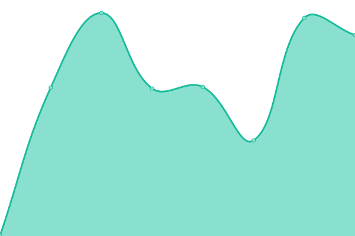
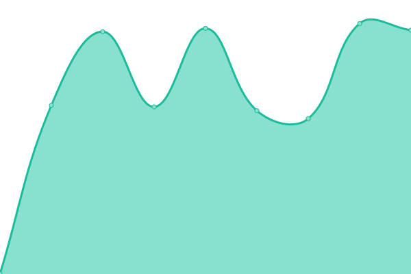
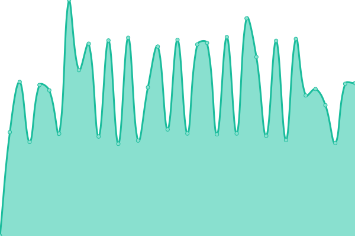
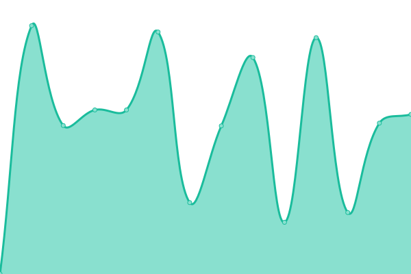
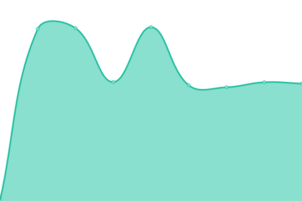
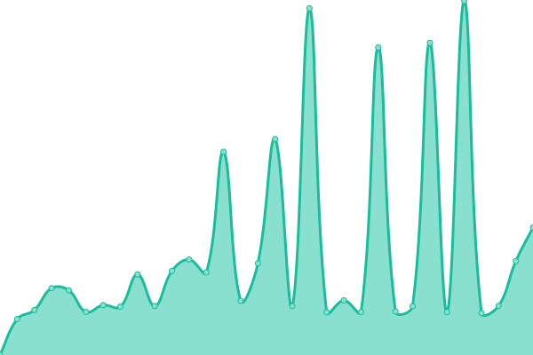
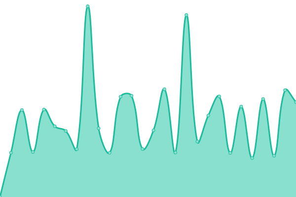
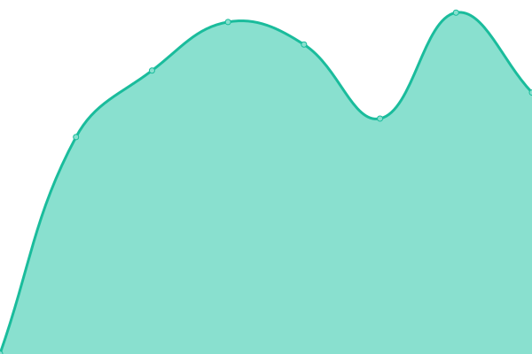
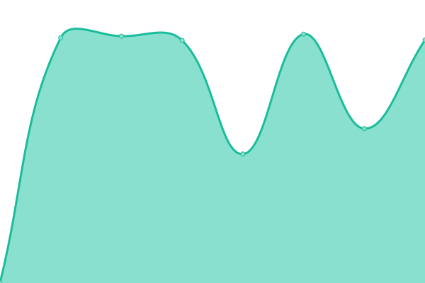

# [📈 Live Status](https://c1rus.github.io/uptime/): <!--live status--> **🟧 Partial outage**

<!--start: status pages-->
<!-- This summary is generated by Upptime (https://github.com/upptime/upptime) -->
<!-- Do not edit this manually, your changes will be overwritten -->
<!-- prettier-ignore -->
| URL | Status | History | Response Time | Uptime |
| --- | ------ | ------- | ------------- | ------ |
|  [cms.alejtech.eu](http://cms.alejtech.eu/UserSystem/login/login.alej) | 🟩 Up | [cms-alejtech-eu.yml](https://github.com/c1rus/uptime/commits/HEAD/history/cms-alejtech-eu.yml) | 

 874ms
     
 | 

<a href="https://c1rus.github.io/uptime/history/cms-alejtech-eu">100.00%</a>
    

|  [cms2.alejtech.eu](http://cms2.alejtech.eu/UserSystem/login/login.alej) | 🟩 Up | [cms2-alejtech-eu.yml](https://github.com/c1rus/uptime/commits/HEAD/history/cms2-alejtech-eu.yml) | 

 646ms
     
 | 

<a href="https://c1rus.github.io/uptime/history/cms2-alejtech-eu">97.60%</a>
    

|  [cms3.alejtech.eu](http://cms3.alejtech.eu/UserSystem/login/login.alej) | 🟩 Up | [cms3-alejtech-eu.yml](https://github.com/c1rus/uptime/commits/HEAD/history/cms3-alejtech-eu.yml) | 

 561ms
     
 | 

<a href="https://c1rus.github.io/uptime/history/cms3-alejtech-eu">100.00%</a>
    

|  [cms4.alejtech.eu](http://cms4.alejtech.eu/UserSystem/login/login.alej) | 🟩 Up | [cms4-alejtech-eu.yml](https://github.com/c1rus/uptime/commits/HEAD/history/cms4-alejtech-eu.yml) | 

 680ms
     
 | 

<a href="https://c1rus.github.io/uptime/history/cms4-alejtech-eu">100.00%</a>
    

|  [cms5.alejtech.eu](http://cms5.alejtech.eu/UserSystem/login/login.alej) | 🟩 Up | [cms5-alejtech-eu.yml](https://github.com/c1rus/uptime/commits/HEAD/history/cms5-alejtech-eu.yml) | 

 1012ms
     
 | 

<a href="https://c1rus.github.io/uptime/history/cms5-alejtech-eu">97.60%</a>
    

|  [intra.hollen.sk](https://intra.hollen.sk/UserSystem/login/login.alej) | 🟩 Up | [intra-hollen-sk.yml](https://github.com/c1rus/uptime/commits/HEAD/history/intra-hollen-sk.yml) | 

 1564ms
     
 | 

<a href="https://c1rus.github.io/uptime/history/intra-hollen-sk">100.00%</a>
    

|  [hint.hollen.sk](https://hint.hollen.sk/) | 🟩 Up | [hint-hollen-sk.yml](https://github.com/c1rus/uptime/commits/HEAD/history/hint-hollen-sk.yml) | 

 148ms
     
 | 

<a href="https://c1rus.github.io/uptime/history/hint-hollen-sk">100.00%</a>
    

|  [b2b.hollen.sk](http://b2b.hollen.sk/sk/Home.alej) | 🟩 Up | [b2b-hollen-sk.yml](https://github.com/c1rus/uptime/commits/HEAD/history/b2b-hollen-sk.yml) | 

 488ms
     
 | 

<a href="https://c1rus.github.io/uptime/history/b2b-hollen-sk">100.00%</a>
    

|  [www.dubravka.sk](https://www.dubravka.sk/) | 🟩 Up | [www-dubravka-sk.yml](https://github.com/c1rus/uptime/commits/HEAD/history/www-dubravka-sk.yml) | 

 1119ms
     
 | 

<a href="https://c1rus.github.io/uptime/history/www-dubravka-sk">100.00%</a>
    

|  [www.ssc.sk](https://www.ssc.sk/sk/Aktualne.ssc) | 🟩 Up | [www-ssc-sk.yml](https://github.com/c1rus/uptime/commits/HEAD/history/www-ssc-sk.yml) | 

 932ms
     
 | 

<a href="https://c1rus.github.io/uptime/history/www-ssc-sk">97.60%</a>
    

|  [www.hollen.sk](http://www.hollen.sk/sk/Home.html) | 🟩 Up | [www-hollen-sk.yml](https://github.com/c1rus/uptime/commits/HEAD/history/www-hollen-sk.yml) | 

 1000ms
     
 | 

<a href="https://c1rus.github.io/uptime/history/www-hollen-sk">97.43%</a>
    

|  [www.iuventa.sk](https://www.iuventa.sk/sk/IUVENTA-home.alej) | 🟥 Down | [www-iuventa-sk.yml](https://github.com/c1rus/uptime/commits/HEAD/history/www-iuventa-sk.yml) | 

 2219ms
     
 | 

<a href="https://c1rus.github.io/uptime/history/www-iuventa-sk">0.00%</a>
    

|  [www.soi.sk](https://www.soi.sk/sk/Novinky-SOI.soi) | 🟩 Up | [www-soi-sk.yml](https://github.com/c1rus/uptime/commits/HEAD/history/www-soi-sk.yml) | 

 930ms
     
 | 

<a href="https://c1rus.github.io/uptime/history/www-soi-sk">97.45%</a>
    

|  [www.datakabinet.sk](https://www.datakabinet.sk/sk/Home.html) | 🟩 Up | [www-datakabinet-sk.yml](https://github.com/c1rus/uptime/commits/HEAD/history/www-datakabinet-sk.yml) | 

 1294ms
     
 | 

<a href="https://c1rus.github.io/uptime/history/www-datakabinet-sk">98.03%</a>
    

|  [www.ozpsav.sk](https://www.ozpsav.sk/sk/Odborovy-zvaz.alej) | 🟩 Up | [www-ozpsav-sk.yml](https://github.com/c1rus/uptime/commits/HEAD/history/www-ozpsav-sk.yml) | 

 2428ms
     
 | 

<a href="https://c1rus.github.io/uptime/history/www-ozpsav-sk">97.60%</a>
    

|  [www.zisk.eu](https://www.zisk.eu/sk/Home.alej) | 🟩 Up | [www-zisk-eu.yml](https://github.com/c1rus/uptime/commits/HEAD/history/www-zisk-eu.yml) | 

 1801ms
     
 | 

<a href="https://c1rus.github.io/uptime/history/www-zisk-eu">97.60%</a>
    

|  [www.priklady.eu](https://www.priklady.eu/sk/Index.alej) | 🟩 Up | [www-priklady-eu.yml](https://github.com/c1rus/uptime/commits/HEAD/history/www-priklady-eu.yml) | 

 1804ms
     
 | 

<a href="https://c1rus.github.io/uptime/history/www-priklady-eu">100.00%</a>
    

|  [www.sizp.sk](https://www.sizp.sk/) | 🟩 Up | [www-sizp-sk.yml](https://github.com/c1rus/uptime/commits/HEAD/history/www-sizp-sk.yml) | 

 1233ms
     
 | 

<a href="https://c1rus.github.io/uptime/history/www-sizp-sk">96.61%</a>
    

|  [master.kabernet.sk](https://master.kabernet.sk/) | 🟩 Up | [master-kabernet-sk.yml](https://github.com/c1rus/uptime/commits/HEAD/history/master-kabernet-sk.yml) | 

 1449ms
     
 | 

<a href="https://c1rus.github.io/uptime/history/master-kabernet-sk">100.00%</a>
    

|  [www.sedackybeta.sk](https://www.sedackybeta.sk/) | 🟩 Up | [www-sedackybeta-sk.yml](https://github.com/c1rus/uptime/commits/HEAD/history/www-sedackybeta-sk.yml) | 

 1376ms
     
 | 

<a href="https://c1rus.github.io/uptime/history/www-sedackybeta-sk">100.00%</a>
    

|  [www.tinytoe.sk](https://www.tinytoe.sk/) | 🟩 Up | [www-tinytoe-sk.yml](https://github.com/c1rus/uptime/commits/HEAD/history/www-tinytoe-sk.yml) | 

 1219ms
     
 | 

<a href="https://c1rus.github.io/uptime/history/www-tinytoe-sk">100.00%</a>
    

|  [www.1cornhill.com](https://www.1cornhill.com/) | 🟥 Down | [www-1cornhill-com.yml](https://github.com/c1rus/uptime/commits/HEAD/history/www-1cornhill-com.yml) | 

 0ms
     
 | 

<a href="https://c1rus.github.io/uptime/history/www-1cornhill-com">0.00%</a>
    

|  [www.sps-sro.sk](https://www.sps-sro.sk/sk/Vitajte-na-SPS.html) | 🟩 Up | [www-sps-sro-sk.yml](https://github.com/c1rus/uptime/commits/HEAD/history/www-sps-sro-sk.yml) | 

 1012ms
     
 | 

<a href="https://c1rus.github.io/uptime/history/www-sps-sro-sk">100.00%</a>
    

|  [www.leopoldov.sk](https://www.leopoldov.sk/) | 🟩 Up | [www-leopoldov-sk.yml](https://github.com/c1rus/uptime/commits/HEAD/history/www-leopoldov-sk.yml) | 

 952ms
     
 | 

<a href="https://c1rus.github.io/uptime/history/www-leopoldov-sk">97.60%</a>
    

|  [www.saledon.sk](https://www.saledon.sk/sk/swiss-army.html) | 🟩 Up | [www-saledon-sk.yml](https://github.com/c1rus/uptime/commits/HEAD/history/www-saledon-sk.yml) | 

 1455ms
     
 | 

<a href="https://c1rus.github.io/uptime/history/www-saledon-sk">100.00%</a>
    

|  [tamagochi.cms4.alejtech.eu](http://tamagochi.cms4.alejtech.eu/) | 🟩 Up | [tamagochi-cms4-alejtech-eu.yml](https://github.com/c1rus/uptime/commits/HEAD/history/tamagochi-cms4-alejtech-eu.yml) | 

 904ms
     
 | 

<a href="https://c1rus.github.io/uptime/history/tamagochi-cms4-alejtech-eu">100.00%</a>
    

|  [alejtech.sitocrm.eu](https://alejtech.sitocrm.eu/UserSystem/login/login.alej) | 🟩 Up | [alejtech-sitocrm-eu.yml](https://github.com/c1rus/uptime/commits/HEAD/history/alejtech-sitocrm-eu.yml) | 

 1045ms
     
 | 

<a href="https://c1rus.github.io/uptime/history/alejtech-sitocrm-eu">100.00%</a>
    

|  [www.kabernet.sk](https://www.kabernet.sk) | 🟩 Up | [www-kabernet-sk.yml](https://github.com/c1rus/uptime/commits/HEAD/history/www-kabernet-sk.yml) | 

 968ms
     
 | 

<a href="https://c1rus.github.io/uptime/history/www-kabernet-sk">100.00%</a>
    

|  [www.idl.sk](https://www.idl.sk) | 🟩 Up | [www-idl-sk.yml](https://github.com/c1rus/uptime/commits/HEAD/history/www-idl-sk.yml) | 

 999ms
     
 | 

<a href="https://c1rus.github.io/uptime/history/www-idl-sk">100.00%</a>
    

|  [www.omnia.sk](https://www.omnia.sk) | 🟩 Up | [www-omnia-sk.yml](https://github.com/c1rus/uptime/commits/HEAD/history/www-omnia-sk.yml) | 

 837ms
     
 | 

<a href="https://c1rus.github.io/uptime/history/www-omnia-sk">100.00%</a>
    

|  [www.slovakiatech.sk](https://www.slovakiatech.sk) | 🟩 Up | [www-slovakiatech-sk.yml](https://github.com/c1rus/uptime/commits/HEAD/history/www-slovakiatech-sk.yml) | 

 915ms
     
 | 

<a href="https://c1rus.github.io/uptime/history/www-slovakiatech-sk">100.00%</a>
    

|  [www.sokratovinstitut.sk](https://www.sokratovinstitut.sk) | 🟩 Up | [www-sokratovinstitut-sk.yml](https://github.com/c1rus/uptime/commits/HEAD/history/www-sokratovinstitut-sk.yml) | 

 1442ms
     
 | 

<a href="https://c1rus.github.io/uptime/history/www-sokratovinstitut-sk">100.00%</a>
    

|  [www.koucovaciaskola.sk](https://www.koucovaciaskola.sk) | 🟩 Up | [www-koucovaciaskola-sk.yml](https://github.com/c1rus/uptime/commits/HEAD/history/www-koucovaciaskola-sk.yml) | 

 2059ms
     
 | 

<a href="https://c1rus.github.io/uptime/history/www-koucovaciaskola-sk">100.00%</a>
    

|  [www.horecaclub.sk](https://www.horecaclub.sk) | 🟩 Up | [www-horecaclub-sk.yml](https://github.com/c1rus/uptime/commits/HEAD/history/www-horecaclub-sk.yml) | 

 748ms
     
 | 

<a href="https://c1rus.github.io/uptime/history/www-horecaclub-sk">100.00%</a>
    

|  [www.rackscale.sk](https://www.rackscale.sk) | 🟩 Up | [www-rackscale-sk.yml](https://github.com/c1rus/uptime/commits/HEAD/history/www-rackscale-sk.yml) | 

 1084ms
     
 | 

<a href="https://c1rus.github.io/uptime/history/www-rackscale-sk">100.00%</a>
    

|  [www.natureland.sk](https://www.natureland.sk) | 🟩 Up | [www-natureland-sk.yml](https://github.com/c1rus/uptime/commits/HEAD/history/www-natureland-sk.yml) | 

 972ms
     
 | 

<a href="https://c1rus.github.io/uptime/history/www-natureland-sk">100.00%</a>
    

|  [www.virtualsan.sk](https://www.virtualsan.sk) | 🟩 Up | [www-virtualsan-sk.yml](https://github.com/c1rus/uptime/commits/HEAD/history/www-virtualsan-sk.yml) | 

 1055ms
     
 | 

<a href="https://c1rus.github.io/uptime/history/www-virtualsan-sk">100.00%</a>
    

|  [www.optikafontana.sk](https://www.optikafontana.sk) | 🟩 Up | [www-optikafontana-sk.yml](https://github.com/c1rus/uptime/commits/HEAD/history/www-optikafontana-sk.yml) | 

 1139ms
     
 | 

<a href="https://c1rus.github.io/uptime/history/www-optikafontana-sk">100.00%</a>
    

|  [www.levare.sk](https://www.levare.sk) | 🟩 Up | [www-levare-sk.yml](https://github.com/c1rus/uptime/commits/HEAD/history/www-levare-sk.yml) | 

 1088ms
     
 | 

<a href="https://c1rus.github.io/uptime/history/www-levare-sk">100.00%</a>
    

|  [www.bellavista.sk](https://www.bellavista.sk) | 🟩 Up | [www-bellavista-sk.yml](https://github.com/c1rus/uptime/commits/HEAD/history/www-bellavista-sk.yml) | 

 1037ms
     
 | 

<a href="https://c1rus.github.io/uptime/history/www-bellavista-sk">100.00%</a>
    

|  [www.lepsilamac.sk](https://www.lepsilamac.sk/co-robime) | 🟩 Up | [www-lepsilamac-sk.yml](https://github.com/c1rus/uptime/commits/HEAD/history/www-lepsilamac-sk.yml) | 

 1561ms
     
 | 

<a href="https://c1rus.github.io/uptime/history/www-lepsilamac-sk">100.00%</a>
    

|  [www.clc.sk](https://www.clc.sk) | 🟩 Up | [www-clc-sk.yml](https://github.com/c1rus/uptime/commits/HEAD/history/www-clc-sk.yml) | 

 1258ms
     
 | 

<a href="https://c1rus.github.io/uptime/history/www-clc-sk">100.00%</a>
    

|  [www.pefc.sk](https://www.pefc.sk) | 🟩 Up | [www-pefc-sk.yml](https://github.com/c1rus/uptime/commits/HEAD/history/www-pefc-sk.yml) | 

 1276ms
     
 | 

<a href="https://c1rus.github.io/uptime/history/www-pefc-sk">100.00%</a>
    

|  [www.toonet.sk](https://www.toonet.sk) | 🟩 Up | [www-toonet-sk.yml](https://github.com/c1rus/uptime/commits/HEAD/history/www-toonet-sk.yml) | 

 893ms
     
 | 

<a href="https://c1rus.github.io/uptime/history/www-toonet-sk">100.00%</a>
    

|  [www.garancnyfond.sk](https://www.garancnyfond.sk) | 🟩 Up | [www-garancnyfond-sk.yml](https://github.com/c1rus/uptime/commits/HEAD/history/www-garancnyfond-sk.yml) | 

 1532ms
     
 | 

<a href="https://c1rus.github.io/uptime/history/www-garancnyfond-sk">100.00%</a>
    

|  [www.amplia.sk](https://www.amplia.sk) | 🟩 Up | [www-amplia-sk.yml](https://github.com/c1rus/uptime/commits/HEAD/history/www-amplia-sk.yml) | 

 748ms
     
 | 

<a href="https://c1rus.github.io/uptime/history/www-amplia-sk">100.00%</a>
    

|  [www.itvkurze.sk](https://www.itvkurze.sk) | 🟩 Up | [www-itvkurze-sk.yml](https://github.com/c1rus/uptime/commits/HEAD/history/www-itvkurze-sk.yml) | 

 883ms
     
 | 

<a href="https://c1rus.github.io/uptime/history/www-itvkurze-sk">100.00%</a>
    

|  [www.lamac.sk](https://www.lamac.sk) | 🟩 Up | [www-lamac-sk.yml](https://github.com/c1rus/uptime/commits/HEAD/history/www-lamac-sk.yml) | 

 1719ms
     
 | 

<a href="https://c1rus.github.io/uptime/history/www-lamac-sk">100.00%</a>
    

|  [www.livinn.sk](https://www.livinn.sk) | 🟩 Up | [www-livinn-sk.yml](https://github.com/c1rus/uptime/commits/HEAD/history/www-livinn-sk.yml) | 

 1109ms
     
 | 

<a href="https://c1rus.github.io/uptime/history/www-livinn-sk">100.00%</a>
    

|  [www.widex-eshop.sk](https://www.widex-eshop.sk/) | 🟩 Up | [www-widex-eshop-sk.yml](https://github.com/c1rus/uptime/commits/HEAD/history/www-widex-eshop-sk.yml) | 

 1383ms
     
 | 

<a href="https://c1rus.github.io/uptime/history/www-widex-eshop-sk">100.00%</a>
    

|  [www.starsforstars.eu](https://www.starsforstars.eu/) | 🟩 Up | [www-starsforstars-eu.yml](https://github.com/c1rus/uptime/commits/HEAD/history/www-starsforstars-eu.yml) | 

 988ms
     
 | 

<a href="https://c1rus.github.io/uptime/history/www-starsforstars-eu">100.00%</a>
    

|  [www.baoffice.sk](https://www.baoffice.sk/) | 🟩 Up | [www-baoffice-sk.yml](https://github.com/c1rus/uptime/commits/HEAD/history/www-baoffice-sk.yml) | 

 750ms
     
 | 

<a href="https://c1rus.github.io/uptime/history/www-baoffice-sk">100.00%</a>
    

|  [www.rosler.sk](https://www.rosler.sk/) | 🟩 Up | [www-rosler-sk.yml](https://github.com/c1rus/uptime/commits/HEAD/history/www-rosler-sk.yml) | 

 1715ms
     
 | 

<a href="https://c1rus.github.io/uptime/history/www-rosler-sk">100.00%</a>
    

|  [www.zuriarchitecture.com](https://www.zuriarchitecture.com/) | 🟩 Up | [www-zuriarchitecture-com.yml](https://github.com/c1rus/uptime/commits/HEAD/history/www-zuriarchitecture-com.yml) | 

 726ms
     
 | 

<a href="https://c1rus.github.io/uptime/history/www-zuriarchitecture-com">100.00%</a>
    

<!--end: status pages-->

[**Visit our status website →**](https://c1rus.github.io/uptime/)

## 📄 License

- Powered by: [Upptime](https://github.com/upptime/upptime)
- Code: [MIT](./LICENSE) © [Upptime](https://upptime.js.org)
- Data in the `./history` directory: [Open Database License](https://opendatacommons.org/licenses/odbl/1-0/)
