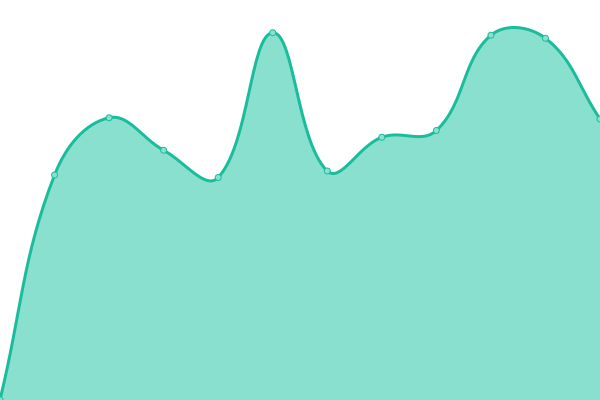

# [📈 Live Status](https://demo.upptime.js.org): <!--live status--> **🟩 All systems operational**

This repository contains the open-source uptime monitor and status page for [Upptime](https://upptime.js.org), powered by [Upptime](https://github.com/upptime/upptime).

With [Upptime](https://upptime.js.org), you can get your own unlimited and free uptime monitor and status page, powered entirely by a GitHub repository. We use [Issues](https://github.com/upptime/upptime/issues) as incident reports, [Actions](https://github.com/c1rus/uptime/actions) as uptime monitors, and [Pages](https://demo.upptime.js.org) for the status page.

<!--start: status pages-->
<!-- This summary is generated by Upptime (https://github.com/upptime/upptime) -->
<!-- Do not edit this manually, your changes will be overwritten -->
<!-- prettier-ignore -->
| URL | Status | History | Response Time | Uptime |
| --- | ------ | ------- | ------------- | ------ |
|  [Slovenská inšpekcia životného prostredia](https://www.sizp.sk) | 🟩 Up | [slovenska-inspekcia-zivotneho-prostredia.yml](https://github.com/c1rus/uptime/commits/HEAD/history/slovenska-inspekcia-zivotneho-prostredia.yml) | 

 1051ms
     
 | 

<a href="https://demo.upptime.js.org/history/slovenska-inspekcia-zivotneho-prostredia">99.32%</a>
    

|  [Lamač](https://www.lamac.sk/) | 🟩 Up | [lamac.yml](https://github.com/c1rus/uptime/commits/HEAD/history/lamac.yml) | 

 1304ms
     
 | 

<a href="https://demo.upptime.js.org/history/lamac">99.34%</a>
    

|  [Rosler](https://www.rosler.sk/) | 🟩 Up | [rosler.yml](https://github.com/c1rus/uptime/commits/HEAD/history/rosler.yml) | 

 1619ms
     
 | 

<a href="https://demo.upptime.js.org/history/rosler">99.32%</a>
    

<!--end: status pages-->

[**Visit our status website →**](https://demo.upptime.js.org)

## 📄 License

- Powered by: [Upptime](https://github.com/upptime/upptime)
- Code: [MIT](./LICENSE) © [Upptime](https://upptime.js.org)
- Data in the `./history` directory: [Open Database License](https://opendatacommons.org/licenses/odbl/1-0/)
